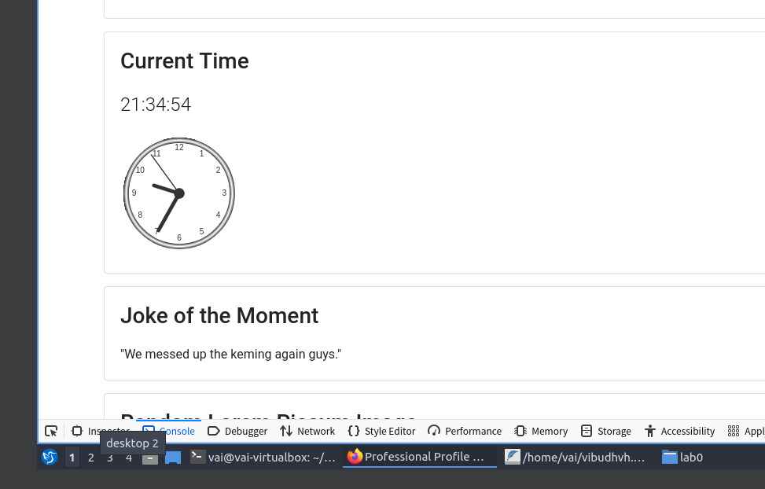
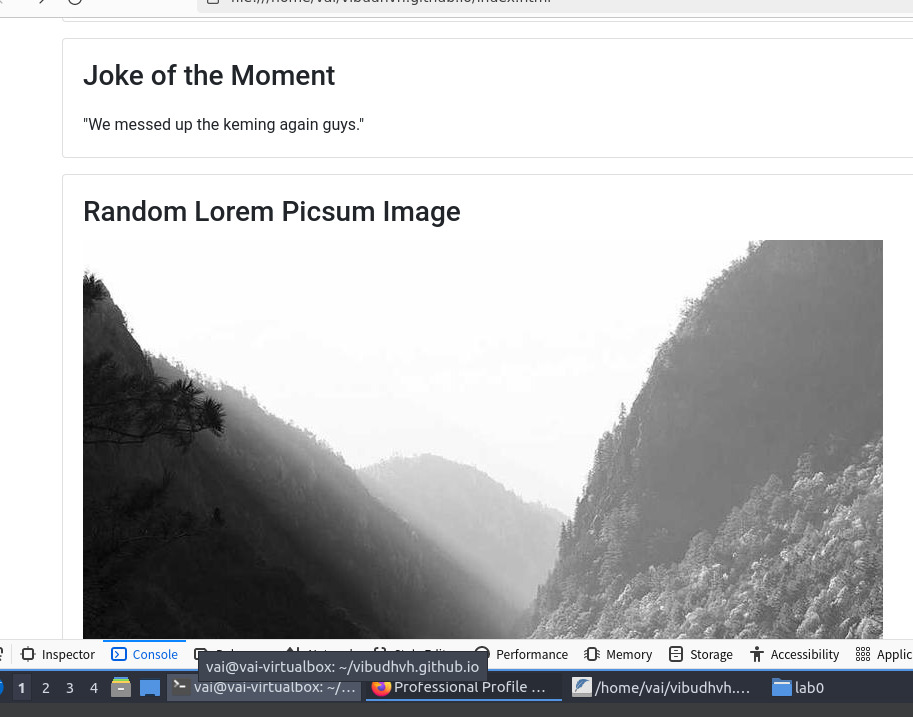

# WAPH-Web Application Programming and Hacking

## Instructor: Dr. Phu Phung

## Student

**Name**: Vaishakh Vibudhendran Nair

**Email**: vibudhvh@ucmail.uc.edu

**Short-bio**: Vaishakh has keen interests in web and app development. 

## Overview

For the Web Application Programming and Hacking (WAPH) project, I developed a comprehensive personal website hosted on GitHub Pages. This professional profile includes my resume, educational background, skills, and experiences targeted towards potential employers. The site incorporates various JavaScript functionalities, APIs, and adheres to non-technical and technical requirements specified for this project.

### Github Repository URL
 

### Website URL
 

### Use of Bootstrap CSS Framework

I used 2 JAVA Script frameworks. Jquery and axios.

These frameworks and libraries are essential for enhancing the functionality and design of the web application. jQuery is used primarily for DOM manipulation and event handling, while Bootstrap provides styling and layout components. Axios facilitates seamless integration with external APIs, enabling dynamic content retrieval and display. Together, they contribute to a responsive and interactive user experience on the webpage.

I utilized the Bootstrap CSS framework to ensure a responsive and visually appealing design for my professional profile. Bootstrap's grid system and components facilitated the layout of elements such as the resume, contact information, and project descriptions, enhancing accessibility across devices.

### Page Tracker Integration

To monitor site traffic and visitor demographics, I integrated a page tracker using Google Analytics. This tool provides insights into user behavior and engagement, essential for optimizing content and user experience.

Basic JavaScript Code
jQuery and JavaScript Frameworks

Digital Clock: Implemented a digital clock that updates every second to display the current time accurately.
Analog Clock: Developed an analog clock using HTML canvas and JavaScript, offering a visual representation of time with hour, minute, and second hands.
Show/Hide Email Functionality: Incorporated a toggle button using jQuery to dynamically show or hide the email address, enhancing user privacy.

Public Web APIs Integration
### JokeAPI and Lorem Picsum random imageIntegration

Integrated the JokeAPI (https://v2.jokeapi.dev/joke/Any) to fetch jokes in various categories every minute. The webpage displays a new joke periodically, enriching user experience with humorous content.
Lorem Picsum API Integration

Utilized the Lorem Picsum API to dynamically fetch and display random images on the webpage. This API integration enhances visual appeal and content variability.
JavaScript Cookies

Implemented JavaScript cookies to remember and greet returning visitors appropriately. On the first visit, users are welcomed with a message indicating their initial interaction with the site. Subsequent visits display a personalized message showing the date and time of their last visit, ensuring a tailored user experience.
Conclusion

The WAPH project provided valuable hands-on experience in web development, JavaScript programming, API integration, and responsive design using Bootstrap. By meeting both non-technical and technical requirements, this project not only enhances my technical skills but also showcases my professional profile effectively to potential employers.

This project demonstrates my ability to leverage modern web technologies to create interactive and user-friendly web applications, essential for succeeding in today's competitive job market.
    
